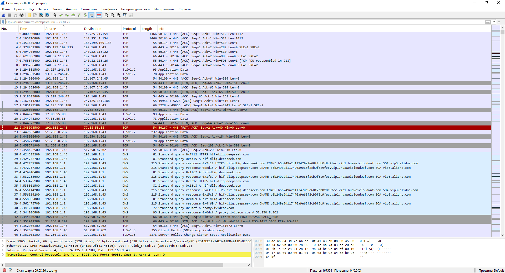
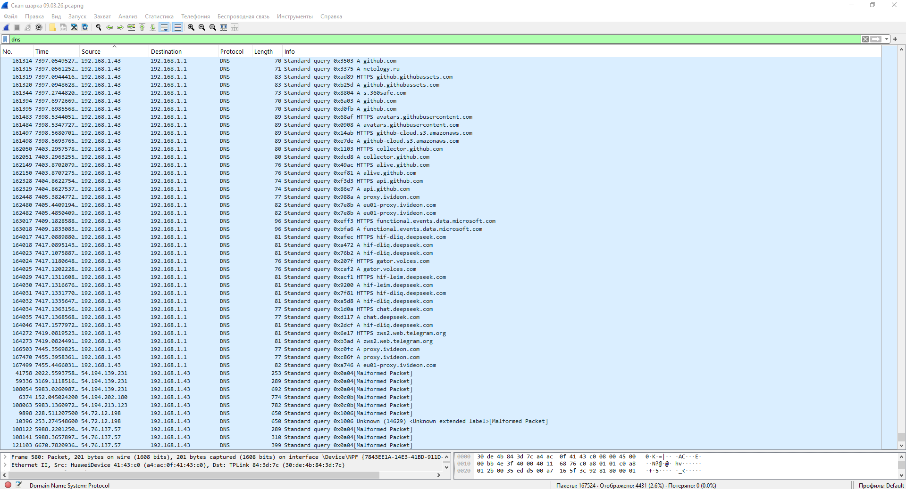
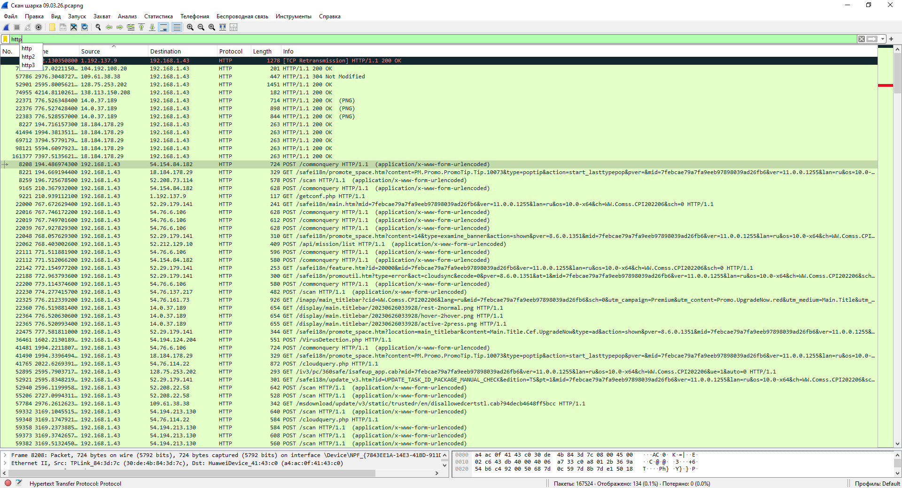
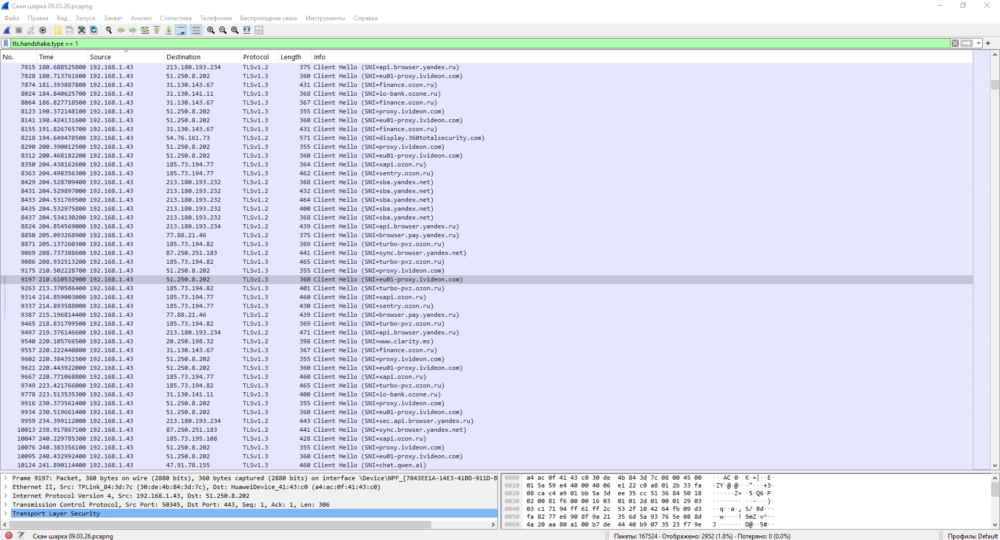
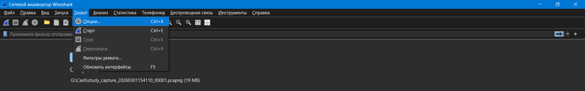
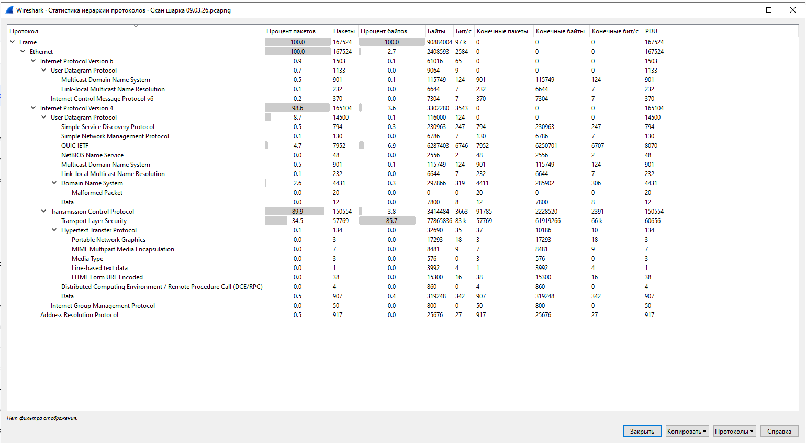

## Задание 3. Анализ сетевого трафика (повышенной сложности)

**Цель:** Захватить и проанализировать сетевой трафик для выявления небезопасных протоколов и подозрительной активности.

### Ход выполнения

#### 1. Захват трафика
Был выполнен захват трафика продолжительностью **45` минут** с использованием Wireshark. В процессе захвата посещались различные веб-сайты, включая HTTP-ресурсы.

#### 2. Анализ DNS-запросов
Для просмотра DNS-запросов использован фильтр:
dns

text

**Результат:** В трафике обнаружены DNS-запросы к следующим доменам:
- `google.com`
- `yandex.ru`
- `youtube.com`
- `http.badssl.com`
- `github.com`
- `netology.ru`

**Вывод:** DNS-запросы видны в открытом виде, что позволяет определить, какие сайты посещает пользователь.

#### 3. Поиск небезопасного HTTP-трафика
Для поиска нешифрованного веб-трафика использован фильтр:
http

text

**Результат:** Обнаружены HTTP-пакеты при обращении к сайту `http.badssl.com`.

В одном из пакетов удалось увидеть содержимое HTTP-запроса:
GET / HTTP/1.1
Host: http.badssl.com
User-Agent: Mozilla/5.0 (Windows NT 10.0; Win64; x64)
...

text

**Вывод:** HTTP-трафик передается в открытом виде. Любые данные, включая cookies и пароли, могут быть перехвачены.

#### 4. Поиск паролей и форм ввода
Для поиска конфиденциальных данных использован фильтр:
http contains "password" or http contains "user" or http contains "login"

text

**Результат:** На сайте `http.badssl.com` не было форм ввода, поэтому пароли не обнаружены. Однако в HTTP-трафике других сайтов видны cookies и заголовки.

**Важно:** При посещении сайтов с HTTPS (например, Google) содержимое пакетов зашифровано и не читается.

#### 5. Анализ защищенных соединений (HTTPS)
Для анализа TLS-рукопожатий использован фильтр:
tls.handshake.type == 1

text

**Результат:** Обнаружены установки защищенных соединений с серверами Google, GitHub и другими.

**Вывод:** HTTPS-трафик шифруется, но факт соединения с определенными серверами (SNI) может быть виден.

#### 6. Поиск подозрительных соединений
Для поиска нестандартных портов использован фильтр:
tcp.port not in {80, 443, 53, 8080} and ip.addr == 192.168.1.43

text

**Результат:** Подозрительных соединений на нестандартные порты не обнаружено.

---

### Сводная таблица результатов

| Тип трафика | Фильтр Wireshark | Обнаружено | Риск |
|-------------|------------------|------------|------|
| DNS-запросы | `dns` | ✅ Да (множество запросов) | Средний (видно историю посещений) |
| HTTP (нешифрованный) | `http` | ✅ Да (http.badssl.com) | Высокий (данные в открытом виде) |
| Пароли в HTTP | `http contains "password"` | ❌ Нет | - |
| HTTPS | `tls.handshake.type == 1` | ✅ Да (большинство сайтов) | Низкий (данные зашифрованы) |
| Подозрительные порты | `tcp.port not in {...}` | ❌ Нет | - |

---

### Интересные наблюдения

1. **DNS-запросы видны всем:** Даже при посещении HTTPS-сайтов, DNS-запросы передаются в открытом виде. Это позволяет провайдеру видеть, какие сайты вы посещаете.

2. **HTTPS не скрывает факт соединения:** В TLS-рукопожатии часто передается **SNI (Server Name Indication)** — имя сервера, к которому вы подключаетесь, тоже в открытом виде.

3. **HTTP — это "стекло":** При использовании HTTP можно увидеть абсолютно всё — заголовки, cookies, содержимое страниц.

4. **Фоновый трафик:** Даже когда вы не сидите в браузере, устройства в сети обмениваются служебными пакетами (ARP, DHCP, MDNS).

---

### Скриншоты ключевых моментов

| № | Описание | Скриншот |
|---|----------|----------|
| 1 | Интерфейс Wireshark во время захвата |  |
| 2 | DNS-запросы |  |
| 3 | HTTP-трафик (нешифрованный) |  |
| 4 | TLS-рукопожатия |  |
| 5 | Статистика протоколов |  |

---

### Выводы по работе

1. **Большинство современного трафика шифруется (HTTPS),** что обеспечивает базовый уровень безопасности.

2. **Опасность представляют сайты без HTTPS:** При посещении HTTP-сайтов вся информация передается в открытом виде и может быть перехвачена.

3. **DNS-запросы остаются уязвимостью:** Они передаются открыто, что позволяет отслеживать историю посещений. Решение — использование DNS-over-HTTPS (DoH) или DNS-over-TLS (DoT).

4. **В домашней сети подозрительной активности не обнаружено:** Все соединения направлены к легитимным серверам.

5. **Wireshark — мощный инструмент анализа:** С его помощью можно не только находить проблемы, но и изучать, как работают сетевые протоколы.

### Рекомендации по безопасности
- Всегда проверяйте наличие HTTPS в адресной строке браузера (замочек)
- Используйте браузерные расширения, принудительно включающие HTTPS (HTTPS Everywhere)
- Настройте DNS-over-HTTPS в браузере или на роутере
- Избегайте ввода паролей на сайтах без HTTPS
